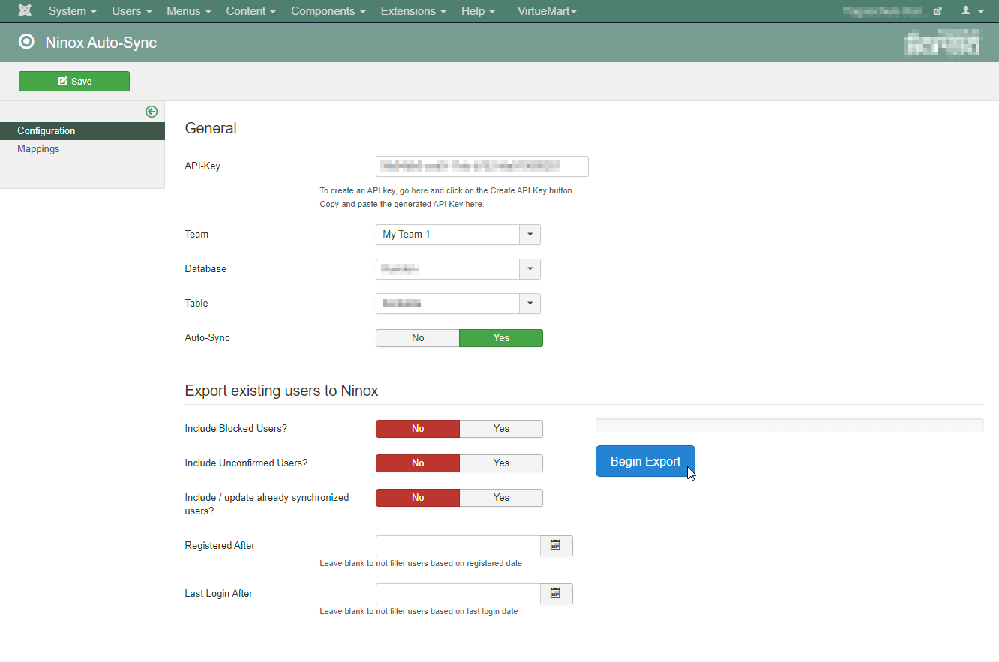
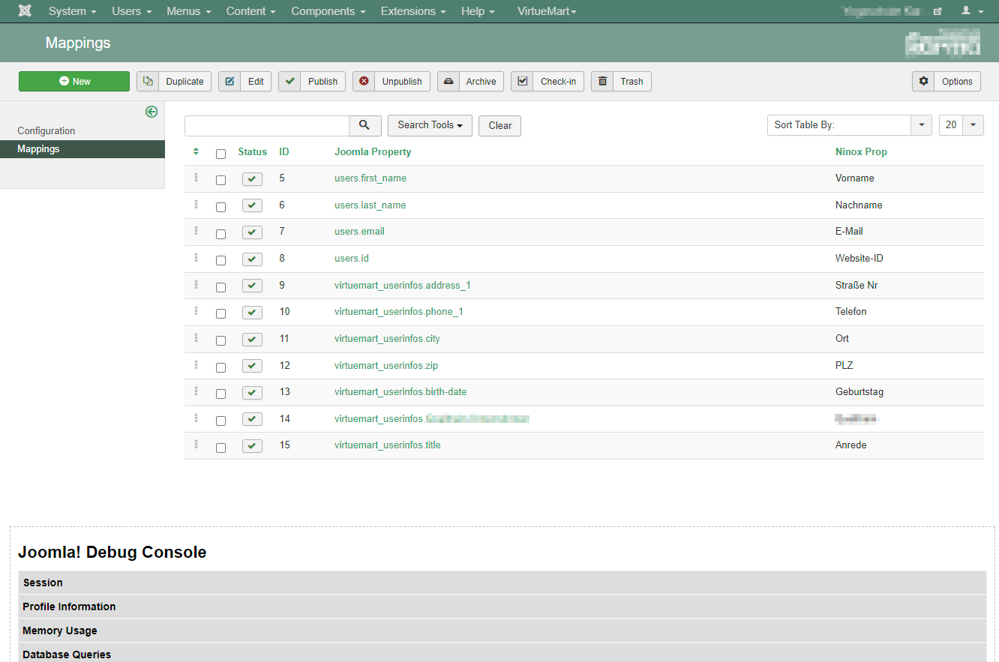

# joomla-ninox

Ninox Auto-Sync lets you synchronize new users and import existing users to your [Ninox](https://app.ninox.com/) account.

Since ninox is a quite dynamic database, this package comes with a very basic a-to-b property mapping. I initially wrote this package for my needs so double check if it's working out for you. You're always welcome to improve this package with you contribution.

Configuration view         | Property mapping view
:-------------------------:|:-------------------------:
 | 

## Package parts

| name              | type        | description
| ----------------- | ----------- | --------------
| `com_ninox`       | `component` | Administrator-UI and main codebase
| `ninox_user`      | `plugin`    | Joomla user changes event trigger handlers
| `ninox_vmshopper` | `plugin`    | Virtuemart user changes event trigger handler (optional; see [see important notes](https://github.com/NecatiMeral/joomla-ninox/issues/5))

## Contributing

Contributions are what make the open source community such an amazing place to be learn, inspire, and create. Any contributions you make are greatly appreciated.

Please bare with me since I am not a native PHP programmer.
